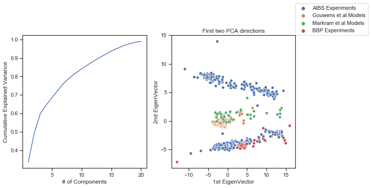
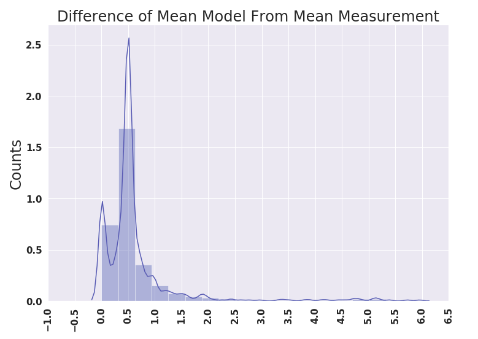

Towards Neuronal Deep Fakes:Data Driven Optimization of Reduced Neuronal Models
========================================================
author: Russell Jarvis, PhD Neuroscience. 
ICON Laboratory.
Co-advisors: Prof Richard Gerkin, Prof Sharon Crook.
date: 5 November 2020


<!--Navigation page
For more details on authoring R presentations please visit <https://support.rstudio.com/hc/en-us/articles/200486468>.

--->

```r
library(reticulate)
knitr::opts_chunk$set(echo = TRUE)
reticulate::repl_python()
```

```
exit
```
Introduction
========================================================

* Negative results are important.
* Fitting to the mean is a bad idea.
I show that fitting to the mean measurement, may work often, but it is also based on flawed methodological assumptions.
- Above threshold spiking fits 'spot the fake' part 2.
- Preferred current versus fixed current search.
- optimal still possible despite rastrigrin's function

Models and Data are Readily Distinguishable in a Reduced Dimension Space
========================================================
Simulation as an Experimental Platform: The Need for Speed
========================================================
- Mean model not mean measurement
- Above threshold spiking fits 'spot the fake' part 2.
- Preferred current versus fixed current search.
- optimal still possible despite rastrigrin's function

Models and Data are Readily Distinguishable in a Reduced Dimension Space
========================================================
Experiments from different brain regions are distiniushible.

Experiments versus models are distinuishable

Models from different brain regions cluster together.





How Genetic Algorithm Optimization Works
========================================================


Identify the counterfit
========================================================


Identify the counterfit
========================================================


Python Pandas
========================================================



Python Pandas
========================================================


 


Python Pandas
========================================================


<!-- Negative results are important. Fitting to the mean is a bad idea.-->
Failure Modes
=======
* Data is spurious.
* Models are not flexible enough to recapitulate data.
* Error Surfaces lack learnable information.
* In my work I found evidence for all 3 types of failure, but before any problems 
could become visible I needed to do lots of experiments presto.


The Need Speed
=======
In order to get a picture of what was going wrong. 
To reveal all of this. Must do heaps of virtual experiments.
To do many experiments quickly I needed faster models so I had to rewrite models using code accelerators. 
as there were very many different types of experiments I would need to do in a short amount of time

Contributions to Science:
=======
* Mainly Negative Results.
* A L5PC was not necessarily great at fitting to mean based data also
* Reduced Models not good at fitting to time constant.
* Demonstrated Reasons why fitting to the mean of neuron electrical experiment data is not a good idea.
* main reason is bi-modality, second reason is covariance structure.


Contributions to Science:
=======
* Positive Results.
* Reduced models could usually fit to FI-curves of experiments.
* Reduced models could fit Some types of spike trains quiete well.


Models are not flexible enough or over fitting or both
=======
When data is good, you could fit a model to the spike times and spike shapes in waveforms.
but only for a single current injection value


Table
=======
| specimen id   |   FITest |  TimeConstantTest |   RestingPotentialTest |   InputResistanceTest |   RheobaseTest |
|---:|---------:|----------:|-------------------:|-----------------------:|----------------------:|---------------:|
|  623960880 |     0.18 |                 23.8 |                  -65.1 |                   241 |             70 |
|  623893177 |     0.12  |               27.8 |                  -77   |                   136 |            190 |
|  471819401 |     0.18 |               13.8 |                  -77.5 |                   132 |            190 |
|  482493761 |     0.09 |                24.4 |                  -71.6 |                   132 |             70 |

Code
=======

Python Code
========

```python
import pandas as pd
```

