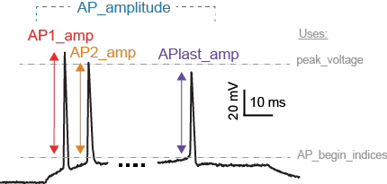

Towards Neuronal Deep Fakes: Data Driven Optimization of Reduced Neuronal Models
========================================================
author: Russell Jarvis, PhD Neuroscience. 
ICON Laboratory.
Co-advisors: Prof Richard Gerkin, Prof Sharon Crook.
Committee: Yi Zhou, James Abbas.
date: 5 November 2020
  


```{r setup, include=FALSE}
knitr::opts_chunk$set(echo = FALSE)
```

## Allen Cell Types Experimental Data


Slicing into Error Hyper-Volume
=======================================================

It is hard to get insight into what the genetic algorithm "sees" one approach is to 
construct 3D error surfaces from 2D pairs. In 10 dimensions there are 40 unique pairs


Slicing into Error Hyper-Volume 2
=======================================================
<!---{ width: 600px; }--->


Slicing into Error Hyper-Volume 2
=======================================================
You can zoom in and take a look at some of 2D parameter pairs.


Virtual Experiments
========================================================


These plots also show you something else. Is I said previously the GA samples
sparsely and incompletely. This means surfaces appear irregular, because polygon
positions are centered semi randomly. You can see that the surface is corrogated
from left to right in the top pane and up-down in the bottom pane.

{ width: 1000; height: 1000}
<!---

--->

Current Voltage Breakdown
=======================================================
{ width: 1000; height: 1000}
Experiment and fitted model both fire at 94 times. For the Izhikevich model to achieve fits on spike times, and voltage base, spike amplitude were traded-off.


Introduction
========================================================
Need to Improve Medicine and Artificial Intelligence.
Need better Electrical Models
Animal Experiments are limited.
Brain simulations would be better if models where faster and more accurate.


Virtual Experiments
========================================================
What they are and why?
Neuronal models are virutal experiments.


Introduction
========================================================


* Negative results are important.
* Fitting to the mean is a bad idea.
I show that fitting to the mean measurement, may work often, but it is also based on flawed methodological assumptions.
- Above threshold spiking fits 'spot the fake' part 2.
- Preferred current versus fixed current search.
- optimal still possible despite rastrigrin's function

Work
=======================================================
4.1 What is Required for Successful Optimization?For optimization to both succeed and be useful, several criteria must be met (Van Geitet al.,2007):
<strong> Relevance </strong>, <strong> Speed </strong>,<strong> Smoothness </strong>


<strong> Relevance </strong>
The objective function should reflect fundamental and important properties of the data that a good model would reproduce. It would be easy to only 

<strong> Speed </strong> The objective function should be fast to calculate, since typically a large number (potentially millions) of evaluations are performed during the search, many of which may require re-simulation of the model.

Efficient Convergence: The solution space should be as continuous and convex as possible,so that the search algorithm can rapidly converge to a global optimum


Bolstered E Marders Claims
=======================================================
Marder considered conductance based models of somato-gastro ganglion cell in lobster
we consider two classes of reduced models in broad categories of experimental cells


========================================================
Simulation as an Experimental Platform: The Need for Speed
========================================================
- Mean model not mean measurement
- Above threshold spiking fits 'spot the fake' part 2.
- Preferred current versus fixed current search.
- optimal still possible despite rastrigrin's function


Art and Science
========================================================
Identify the Features (ingredients) that will add up to good recipes


Science
=======================================================
Show how some ingredients lead to bad recipeas.


Action Potential Amplitudes
========================================================
Action Potential height as it varies along the spike train.


After hyperpolarisation Potential.
========================================================


Models and Data are Readily Distinguishable in a Reduced Dimension Space
========================================================
48 out of 240 features.

Models and Data are Readily Distinguishable in a Reduced Dimension Space
========================================================
Experiments from different brain regions are distiniushible.

Experiments versus models are distinuishable

Models from different brain regions cluster together.


# Alternatives to Eve Marder Dilemna
Fitting to experimental means can work but is not reliable.
Depends on assumptions of data covariance.
Alternatives: Fit to the whole trace of a single experiment.


Models and Data are Readily Distinguishable in a Reduced Dimension Space
========================================================

2nd Eigen Vector
=======
| Feature Name   |  Feature Description | Extraction Library Stimulus Strength |
|---:|---------:|---------------:|
|  fast-trough-index |     Index into array when begging of trough occurs | Allen 1.5× Rheobase |             241 |    
|  peak-index-1.5x |     0.12  |               27.8 |                  -77   |                   136 |            190 |
|  upstroke-index-1.5x |     0.18 |               13.8 |                  -77.5 |                   fast-trough-index |            190 |
|  peak-index indexs |     0.09 |                24.4 |                  -71.6 |                   132 |             70 |
|threshold-index |

fast-trough-index Index into array when begging of trough occurs Allen 1.5× Rheobase
peak-index-1.5x Index into array when peaks occurs Allen 1.5× Rheobase
upstroke-index-1.5x index into array of detection of first upward phase of AP Allen 1.5× Rheobase
threshold-index-1.5x Description Allen 1.5× Rheobase
fast-trough-time The time when a trough is commenced Allen 1.5× Rheobase
fast-trough-index Indexs into array when the start of a trough is entered Allen 3.0× Rheobase
peak-index indexs into array when voltage peak(s) occur Allen 3.0× Rheobase
upstroke-index Index into array when first upward phase of a spike commences Allen 3.0× Rheobase
threshold-index Index into array when threshold(s) are surpassed Allen 3.0× Rheobase


How Genetic Algorithm Works
========================================================

An engine that drives the whole work
True solution inaccessible $10^{n}$
Wont get trapped

Identify the counterfit
========================================================


Identify the counterfit 2
========================================================


Spot the fake part 3.
========================================================
High density firing without adaptation


IZHIkevich_fit_60Adexp_80.jpg
========================================================


Mean model not equal to model mean
========================================================

$(a-b)/2$


skewed_distribution.png
========================================================


reproduced_izhi.png
========================================================


<!--
parameter_b_hopeless_surface2.png

-->


What is a Feature
========================================================
<center>


</center>
 


Visualization of Eigen Vector Loadings
========================================================


<!-- Negative results are important. Fitting to the mean is a bad idea.-->
Data Driven Optimization can be Fragile. 
Optimization Needs Special Conditions
=======
## Possible Causes of Failure:
* 1 Models are not flexible enough to recapitulate important variance in data
* 2 Data is reliable but misrepresented (1 & 3 are sound but).
* 3 (1 & 2 are sound but) Error Surfaces lack learnable information.

Controls. 1 and 3 can be controlled by randomly simulating data, but checking the learnability of error surfaces.
* * In my work I found evidence for all 3 types of failure, but before any problems 
2. Cannot be directly controlled but the data can be interrogated.


Hardening Optimization, by Controlling for failure.
=======
## Possible Causes of Failure:
* 1 Models are not flexible enough to recapitulate important variance in data
* 2 Data is spurious (1 & 3 are sound but).
* 3 (1 & 2 are sound but) Error Surfaces lack learnable information.

Controls. 1 and 3 can be controlled by randomly simulating data, but checking the learnability of error surfaces.
2. Cannot be directly controlled but the data can be interrogated.


The Need Speed
=======
In order to get a picture of what was going wrong. 
To reveal all of this. Must do many virtual experiments.
To do many experiments quickly I needed faster models so I had to rewrite models using code accelerators. 
as there were very many different types of experiments I would need to do in a short amount of time


Although Genetic Algorithms are Overall Robust
=======
In neuronal modelling 
They still are fragile in the sense that they benefit 
From human design supervision and testing

Can exploit global convexity of complex surface
satisficing
Still Vulnerable to poor learning environments
Still benefit from supervision and intervention.

Can fall back to random sampling
With memory of best.


Error Surface Defects
========================================================
The 10% of surfaces that are practical to visualize.

12 variables 


E Marder 
========================================================
Showed What can go wrong when fitting models to the mean of electrical neuron data
when the mean and variance violates assumptions of normal distributions.snk
<!--
E Marder postulated, that the mean model is not always a good 
representation of neuronal electrical recordings, and that bad things could happen 
if you fit models to the mean.

Marder showed this in conductance based models of the lobster somato-gastrion-ganglion neuron.
-->


friendly_error_surface.png
========================================================


Error Surface Defects
========================================================


In 10 dimensions 40 unique pairs of dimensions in error hyprevolume
========================================================
That is a mess.


Error Surface Defects
========================================================


Contributions to Modeling:
=======
Two fast models.
Auto code generation to make novel feature/data combinations.

High dimensional exploration of variance in data and models.

Contributions to Science:
=======
* Recipe for fitting to Izhikevich and AdEx models to 
* spike train shape+AP times
* recipe for fitting Izhikevich and AdEx models to FI curves.
* better understanding of model limits (shape is often incompatible with firing frequency current relationship.) Probably because of underlying representations of capacitance, and resistance (a,b), are more like fudge factors than anything else.

Contributions to Science:
=======
* Spike shape and spike times seem conflicted.
* More complex models don't necessarily fit better.
* Reduced Models not good at fitting to time constant.
* Demonstrated Reasons why fitting to the mean of neuron electrical experiment data is not a good idea.
* main reason is bi-modality, second reason is variance structure (skewed).

Contributions to Science:
=======
* Fitting to FIcurve usually possible
* Spike shape and spike times seem conflicted.
* More complex models don't necessarily fit better.
* Reduced Models not good at fitting to time constant.
* Demonstrated Reasons why fitting to the mean of neuron electrical experiment data is not a good idea.
* main reason is bi-modality, second reason is covariance structure.

<!--
* A L5PC was not necessarily great at fitting to mean based data also-
-->

Contributions to Science:
=======
* Reduced models could usually fit to FI-curves of experiments.
* Reduced models could fit Some types of spike trains quite well.
* Reduced models could be over-fitted to spike shape.


Models are not flexible enough or over fitting or both
=======
When data is good, you could fit a model to the spike times and spike shapes in waveforms.
but only for a single current injection value


Table
=======
| specimen id   |   FI Slope Gradient |  TimeConstantTest |   RestingPotentialTest |   InputResistanceTest |   RheobaseTest |
|---:|---------:|----------:|-------------------:|-----------------------:|----------------------:|---------------:|
|  623960880 |     0.18 |                 23.8 |                  -65.1 |                   241 |             70 |
|  623893177 |     0.12  |               27.8 |                  -77   |                   136 |            190 |
|  471819401 |     0.18 |               13.8 |                  -77.5 |                   132 |            190 |
|  482493761 |     0.09 |                24.4 |                  -71.6 |                   132 |             70 |


The End: Acknowledgements:
==========
This body of work was a large international team effort that was only possible because of
continuous attention from diverse faculty at ASU.
First and foremost I would like to thank my committee: Professor Sharon Crook, Professor Rick
Gerkin, Professor Jimmy Abbass, and Professor Yi Zhou. Additionally Sharon Crook and Jimmy
Abbas offered significant unexpected personal support. Lastly, Rick poured many hours of his life
into consulting about this project. Thanks generally to the ASU research community
<!---
Other sources of general support came Professor John Alcock who allowed me to lodge for free in
his house and, SOLS Graduate Program Associate Directory Professor Emilia Martins, Professor
Julie Liss, Professor Susanne Neuer, and Professor Bradley Gregor, were called on. I would also
like to thank Amy Pate who helped with VR and Augmented reality technology.
I would also like to thank the late Jane Hurley, a recent PhD graduate from ASU Department of
Exercise and Nutritional Sciences, who put significant work into making Arizona desert accessible
to outsiders, and offered significant personal support. I would also like to thank the Anthony
Nicholas for inspiration and Imogen Hamel-Green, and the Hamel-Green family.
I would also like to thank my parents, as well as the late Jane Hurley, a recent PhD graduate from
ASU who offered significant personal support.
“When applying digital methods, you may have to try very many different things” – Emilia Martins
I would also like to thank Research Professional Renate Mittelmann for supporting an early and
difficult transition to Docker-driven development.

deceptively difficult problem. 
Mohammad Samavat had a poster on this problem when I first arrived at ASU.
-->

What is publishable Now:
==========
Mean model not mean measurement. 
* Problems of using the mean to optimize with.


Pre-emptive Question Slides from committee.
==========


 
  

 
<strong>9 * 9 dimensions</strong>
 <br>
 <p> did it work? </p>

To find out about the brain we can do virtual experiments.
==========


speed, results might violate your assumptions, and could be not what is expected, provoking more experiments.

speed 3.
The most common type of result is tentative, to get results that are consistent in a system, need prompt feedback.

smoothness 3 , and relevance  6.


What is publishable With More work:
==========


# References

<div id="refs"></div>


