
<!--
backgroundImage: url('https://marp.app/assets/hero-background.jpg')
-->
# **Towards Neuronal Deep Fakes:**
### Data Driven Optimization of Reduced Neuronal Models
author: Russell Jarvis, PhD candidate Neuroscience. 
ICON Laboratory.
Co-advisors: Prof Richard Gerkin, Prof Sharon Crook.
PhD Committee: Prof Richard Gerkin, Prof Sharon Crook Prof Yi Zhou, Prof James Abbas.
date: 5 November 2020

---

### World Health Organisation
* Diseases of the brain are wide ranging, effect many people, and cost world economies significant money.
* Robots which depend on artificial intelligence can do dangerous things, like close down Fukishima Reactor.

---

# Introduction 
- Better electrical models of the brain are needed.
- Better brain models will Improve Brain Medicine and Artificial Intelligence.
- Current models are lacking in speed, accuracy, and interprebility.
- Fortunately models can be  improvemed. There are some leads about how to make models: faster more accurate, and more interpretable.

---

### What is a model.
A map is a model of structure
* A map of Tempe is not copy of Tempe
<!--, it is not a life size replica 100 miles away. -->
* A map of Tempe can have relevant features. It could represent channels and sewers, but a lot of people just want to know where various shops are and the roads to take them there. For some people roads and shops and nature are relevant.

---

### Diverse Instruments Create Diverse Sounds

---

### Diverse Neurons Create Diverse Voltage Patterns

<!--
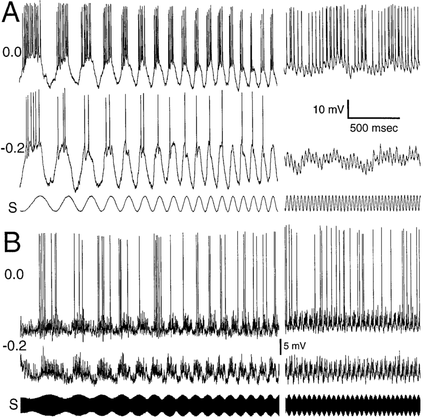
-->

<!--
 In music the time of events is important.
* In music you can fake an instrument with a synthesizer. In network models, we want to fake a neuron as if its an instrument.
* but the shape of a sound wave also contributes timber.
* a synthesizer has many knobs to adjust parameters.
* model governing equations also have many knobs
* A synthesizer is an arbitary wave form generator, by adjusting the knobs you can "model" any instrument, that is you can replicate it, without modelling everything.

-->

---
### Special Neuron Models are "Tunable"
<!--* Diverse neurons, are like choir participants, they have different temporal properties like an old smoker, or a young pure voice.-->

---
<!--

-->
### Virtual Experiments

* What they are and why?
Many Electrical Neuron Models 
are capable of simulation applied current injections at the cell soma.
* Virtual experiments are a way of finding out information about in vitro cells. Virtual experiments can also help to bring models and in vivo cells into better alignment.

### Why would we need to Optimize?
* Without proper alignment models may fail to capture 
important biological details they were intended to represent.
* Virtual Experiments can help us to optimize.

---

### Music Notation A map of When Sound Events occur.
* I said that a map is a model
* When do drum beats occur 1 bar in in semi crochets?
* When does cello occur four bars in, in crochets.

* Feature extraction libraries are a bit like music notation for neuron events.
---

### Virtual Experiments Gather Useful Measurements: Features <!--fit--> 
* These Measurements are collectively called Features.
* Action Potential height as it varies along the spike train.
* Example Features:

---

<!--
Features: Linear behavior of the cell 

-->

### Single Spike Shape: After Hyperpolarisation Potential. <!--fit--> 
  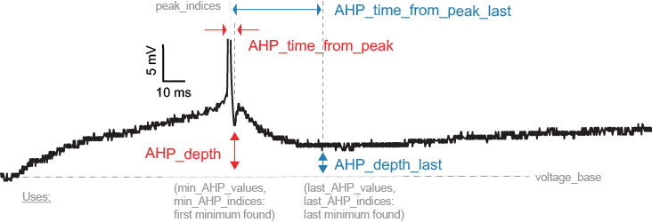
The work load in feature extraction is about 75 \% done.
Existing researchers have already decided what is relevant or valueable, they have written feature extraction pathways. 

---
<!--models are virtual experiments.-->
<!--* Negative results are important.-->
<!--
* Fitting to the mean is a bad idea.
I show that fitting to the mean measurement, may work often, but it is also based on flawed methodological assumptions.
- Above threshold spiking fits 'spot the fake' part 2.
- Preferred current versus fixed current search.
- optimal still possible despite rastrigrin's function
-->

### Computer Algorithms are like Recipes.
<!--True but not the point I need to make
The ordered sequence of adding ingredients matters.
-->
Ingredients (**data**, and **features**). 
* With the wrong ingredients Error surfaces can become 
* too complicated for machine learning to learn.
<!--* Because GA can satisfice they return reasonable solutions in a short -->

---

### What Representation of Data to Fit Models?
This can be the cause of issues that I will visit later.

---
<!--
### What Representation of Data to Fit Models?
The wrong This can be the cause of issues that I will visit later.

-->

### Error Generation Recipe

* Measure a thing ie pitch volume or spike height.
* Check the disparity actual vs desired
 

---

### The Genetic Algorithm Recipe

An engine that drives a lot of results in this work
True solution inaccessible 

---

### How well does it work?
* The very best you could hope for is 
* both spike times and spike shape is matched
* and noise is not fitted, its discarded
* How well did I do?

---

Identify the counterfit
========================================================

---

### Identify the model

---

Identify the counterfit 3
========================================================
* High firing rate without adaptation

---

# Which features:
**Lots of direct spike timing measurements**
* Spikecount,mean_frequency, and adaptation_index
* mean_AP_amplitude
* min_voltage_between_spikes
* minimum_voltage 
* peak_voltage
* voltage_base
* Two AHP measuments
---

<!--
### Optimization Failure

* 48 spikes are matched 
* $$ base\ V_{M}\ matches $$
---

### Error Signal
and change the system. Tweek knobs on synthesizor.

---

It is hard to see but generally spike time and spike shape conflict.
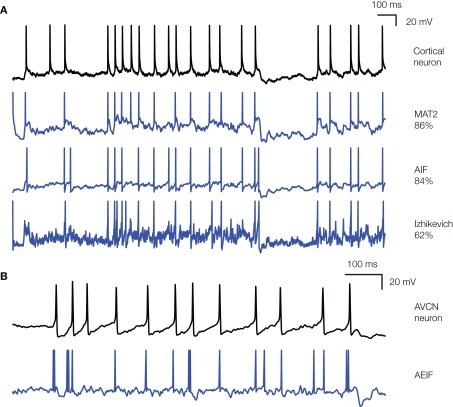

-->

### How good are Pre-Existing Fits?
#### Shape/ Spike Time Trade-off
* When Fitting to spike times, spike shape is traded off.
Generally spike time and spike shape conflict.

---

### Does not Always Work
**What is Required for Successful Optimization?** <!--fit--> 
4.1 What is Required for Successful Optimization?For optimization to both succeed and be useful, several criteria must be met:
**Overall Speed**,**Smoothness** of Error Function, and **Relevance**
(Van Geit et al, 2007)

---
<!--biological relevance is desirable, but it is not necessary-->

### Relevance 
**Relevance:** The objective function should reflect fundamental and important properties of the data that a good model would reproduce. 

<!--Ie the model should not fit to noise in the data, or exclusively a small part of a waveform, such as exclusively getting a minor detail right like the depth of an AHP.-->

* The RMSE is not relevant.
* The Fourier Transform is not interpretable or relevant.
---

**Speed:** Models, Errors, optimization, the whole work flow needs to be fast to calculate, since typically a large number 
$$ > 1,000,000\ \ models $$ 
best if each one is only ~2 ms
Each model evaluations are performed during the search, many of which may require re-simulation. I will explain more about this later. Largely this is needed to deal with human limitations
* The human designer benefits from prompt feed back about violated assumptions.

---

### Fast Work Flow

If not for numba I may still be waiting for results, the type of results which may bring old assumptions into doubt.

---

### Smooth Learnable Error Surface
**Efficient Convergence:** The solution space should be as continuous and convex as possible,so that the search algorithm can rapidly converge to a global optimum

* More about this later
---

<!--

Wont get trapped
How good were fits?
How good are these fits with regards to other standards?

Simulation as an Experimental Platform: The Need for Speed
- Mean model not mean measurement
- Above threshold spiking fits 'spot the fake' part 2.
- Preferred current versus fixed current search.
- optimal still possible despite rastrigrin's function

Identify the Features (ingredients) that will add up to good recipes
Science
Show how some ingredients lead to bad recipeas.
-->

### Part 2
**Experimental Data**: 
* 477 recordings Allen Institute Cell Types Database (primary visual cortex)
* 41 recordings Blue Brain Portal (somatosensory cortex)

---

**Pre existing Cortical Models**:      
* 972 models from NeuroML-DB
Cortical Models:      
* Total Combined Samples: 1498
* 415 features of multi-spiking waveforms
* Only 48 usable features

---

**Data and Models are united by A Common Experiment /virtual Experiment**:      

---

### Variance In Experiments Variance in Models

---

### Variance In Experiments Variance in Models

---

### Variance In Experiments Variance in Models

---

### What would this look Viewed at Once?
* Here is a small chunk.

---

### What would this look Viewed at Once?
* And Another chunk.

---
### Low Dimensional Space

---

### Visualization of Eigen Vector Loadings
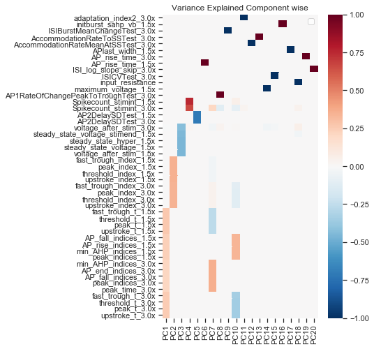

---

### What are the dimensions?

---

### Existing Neuronal Modelling space is vast.
Real data sets are vast.
without comparing single models to single data.
Analysis of variance models vs experiments.

* Many of the indexs relate to when Neuron Experienced **peak voltages**, but also when where the **trough.** beginning and end times, so most of the indexs related to spike timing.

<!---
|Feature Name|PC1|
|:---:|:---:|---:|
AP_end_indices_3.0x|0.2125187848394078|0.0
AP_fall_indices_1.5x|0.24044566196436074|0.0
AP_fall_indices_3.0x|0.21249945565465067|0.0
AP_rise_indices_1.5x|0.240317621163258|0.0
fast_trough_index_1.5x|0.0057053985408204505|0.3562230346687214
fast_trough_index_3.0x|0.0|0.3514447575306276
fast_trough_t_1.5x|0.2685361985803759|0.0
fast_trough_t_3.0x|0.25205146577660975|0.0
min_AHP_indices_1.5x|0.2405590926107427|0.0
min_AHP_indices_3.0x|0.21226118997266166|0.0
peak_index_1.5x|0.006739374730066852|0.35600560087959016
peak_index_3.0x|0.0|0.35092602809984896
peak_indices_1.5x|0.2409257389470201|0.0
peak_indices_3.0x|0.21250230876077303|0.0
peak_t_1.5x|0.2692595292661935|0.0
peak_t_3.0x|0.25133956213673186|0.0
peak_time_3.0x|0.212502308760773|0.0
threshold_index_1.5x|0.006831936703568009|0.35596648121018953
threshold_index_3.0x|0.0|0.3509021155260781
threshold_t_1.5x|0.2692575177650672|0.0
threshold_t_3.0x|0.25133025618807375|0.0
upstroke_index_1.5x|0.0068126684268745305|0.3559758078582268
upstroke_index_3.0x|0.0|0.35091232624961005
upstroke_t_1.5x|0.26925982972152745|0.0
upstroke_t_3.0x|0.25134113562573235|0.0
voltage_after_stim_3.0x|-0.0022842243309869575|0.0
--->

---

### Conclusions  Models and Data are Readily Distinguishable in a Reduced Dimension Space
* 48 features.
* Number of samples
If models and experiments are still distinguishable it means
* Models need revision.
* Models need More specific optimization.
* Since optimization conditions are fragile, if 2 is true. 
Its sometimes hard to find the right approach.
Models and Data are Readily Distinguishable in a Reduced Dimension Space

---

###

---

###

---

###
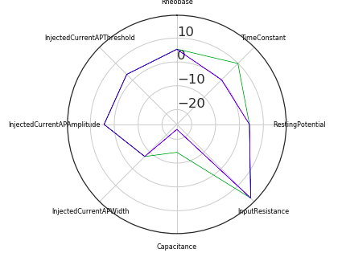

---

How Often Does Significant Non Linearity Occur?
========================================================
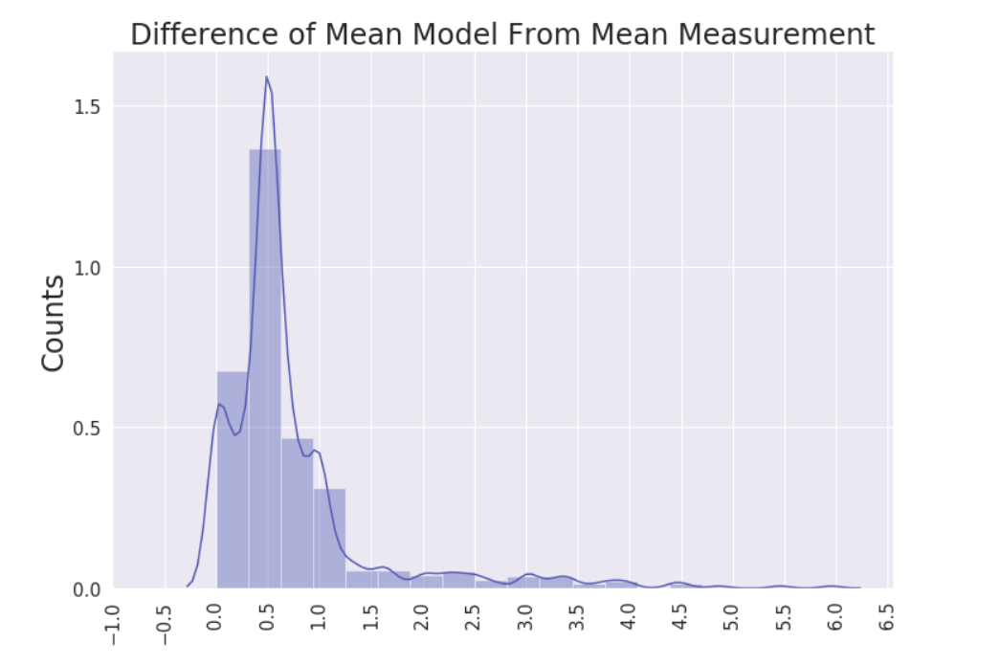

---

### Which Data Representation is best?.
* In vitro and In silico neurons both have 
significant non-linearities.
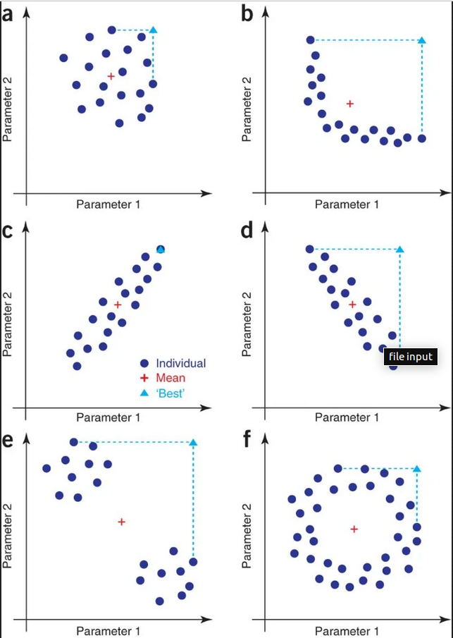

---

###
* make two random models.
* compute features. 
* for each feature, you get the model1 value of the feauture (x1) and the model2 value of the feature (x2)
$$ delta_{x} = x2-x1 $$
x12 is the mean model.
$$  (x_{12} - x1)/delta_{x} $$
$$ between two points
For the mean model, you also get a feature, call it x12.
10:50
Compute
10:51
This will be 0.5 when the mean model produces a feature exactly between the feautres of the two original models
10:53
Plot the distribution of these values across ~100 runs of this (each run you pick two random models)

---

### Experiments from different brain regions are distingiushible.
* Experiments versus models are distinguishable
* Models from different brain regions cluster together.

---
### 

# Part 3

Fitting to experimental means can work but is not reliable.
Depends on assumptions of experimental data variance.
Alternative: 
Fit to the whole trace of a single experiment.
Sources of experimental error will not be averaged away

---
<!--
[allen_exp](figures/mouse_opt_data.png)
-->

# Models and Data are Readily Distinguishable in a Reduced Dimension Space <!-- fit --> 

---
<!--
* **fast-trough-index**: Index into array when begging of trough occurs **1.5** 
$$1.5 \times rh$$ 
* Two
* Three
| Feature Name   |  Feature Description | Extraction Library Stimulus Strength |
|---:|---------:|---------------:|
| fast-trough-index |Index into array when begging of trough occurs | Allen 1.5× Rheobase |    
| peak-index-1.5x | Index into array when peaks occurs | Allen 1.5× Rheobase |                              
|  upstroke-index-1.5x | Index into array of detection of first upward phase of AP | Allen 1.5× Rheobase |
|  fast-trough-index | The time when a trough is commenced Allen | 1.5× Rheobase |
|  peak-index indexs | Indexs into array when the start of a trough is entered | Allen 3.0× Rheobase |
| threshold-index | Index into array when threshold occurs | Allen 3.0× Rheobase | <!-- fit --> 
-->

<!--fast-trough-index Index into array when begging of trough occurs Allen 1.5× Rheobase
peak-index-1.5x Index into array when peaks occurs Allen 1.5× Rheobase
upstroke-index-1.5x index into array of detection of first upward phase of AP Allen 1.5× Rheobase
threshold-index-1.5x Description Allen 1.5× Rheobase
fast-trough-time The time when a trough is commenced Allen 1.5× Rheobase
fast-trough-index Indexs into array when the start of a trough is entered Allen 3.0× Rheobase
peak-index indexs into array when voltage peak(s) occur Allen 3.0× Rheobase
upstroke-index Index into array when first upward phase of a spike commences Allen 3.0× Rheobase
threshold-index Index into array when threshold(s) are surpassed Allen 3.0× Rheobase -->

Strengthened Some Pre-Existing Theoretical Claims
=======================================================
Marder considered conductance based models of somato-gastro ganglion cell in lobster
we consider two classes of reduced models in broad categories of experimental cells

---

Mean model not equal to model mean
=======================================================

---

<!--skewed_distribution.png
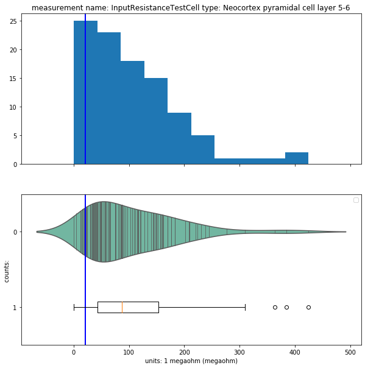
-->

<!--
parameter_b_hopeless_surface2.png
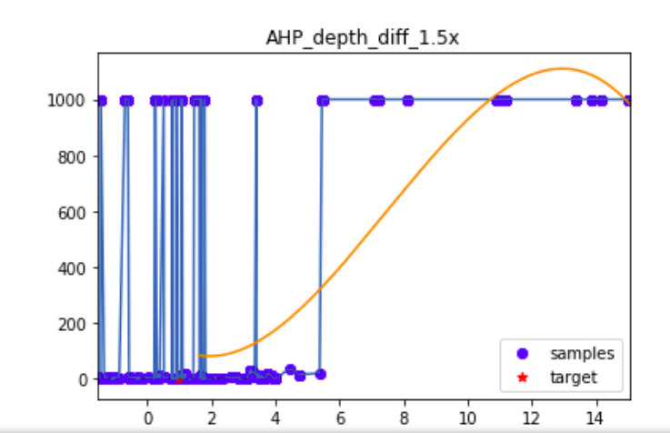
-->

 

### Data Driven Optimization can be Fragile. 
#### Optimization Needs Special Conditions
##### Possible Causes of Failure:
* 1 Models are not flexible enough to recapitulate important variance in data
* 2 Data is reliable but misrepresented (1 & 3 are sound but).
* 3 (1 & 2 are sound but) Error Surfaces lack learnable information.

---

### Controls. 1 and 3 can be controlled by randomly simulating data, but checking the learnability of error surfaces.
* * In my work I found evidence for all 3 types of failure, but before any problems 
2. Cannot be directly controlled but the data can be interrogated.

---

### Hardening Optimization, by Controlling for failure.
## Possible Causes of Failure:
* 1 Models are not flexible enough to recapitulate important variance in data
* 2 Data is spurious (1 & 3 are sound but).
* 3 (1 & 2 are sound but) Error Surfaces lack learnable information.

Controls. 1 and 3 can be controlled by randomly simulating data, but checking the learnability of error surfaces.
2. Cannot be directly controlled but the data can be interrogated.

---

### The Need Speed
* In order to get a picture of what was going wrong. 
* To reveal all of this. Must do many virtual experiments.
* To do many experiments quickly I needed faster models so I had to rewrite models using code accelerators. 
as there were very many different types of experiments I would need to do in a short amount of time

---
### Although Genetic Algorithms are Overall Robust
* In neuronal modelling 
* They still are fragile in the sense that they benefit 
From human design supervision and testing

---

### High Dimensional Space

---

### slice
Small part of Error Hypervolume reveals a problem

---

### Bad Recipe Ingredients A Closer Look:

---

###

### Slightly Bad Recipe Ingredients
### Error Surface Defects

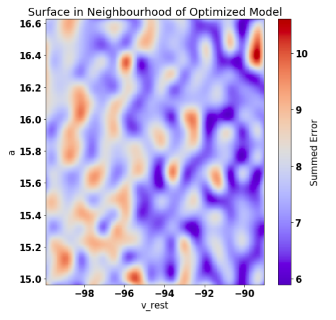

---

### Good recipe ingredients:

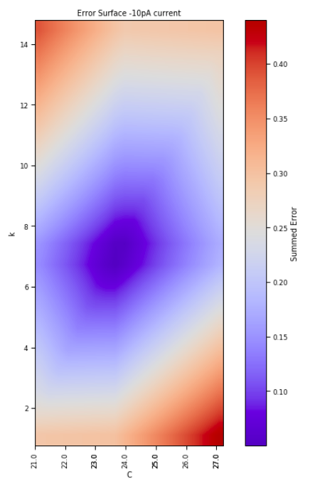

---

<!--
Can exploit global convexity of complex surface
satisficing
Still Vulnerable to poor learning environments
Still benefit from supervision and intervention.

Can fall back to random sampling
With memory of best.-->

### Error Surface Defects

The 10% of surfaces that are practical to visualize.
12 variables 

---

### E Marder 

Showed What can go wrong when fitting models to the mean of electrical neuron data
when the mean and variance violates assumptions of normal distributions.snk

---

<!--
E Marder postulated, that the mean model is not always a good 
representation of neuronal electrical recordings, and that bad things could happen 
if you fit models to the mean.

Marder showed this in conductance based models of the lobster somato-gastrion-ganglion neuron.
-->

<!--friendly_error_surface.png
========================================================
-->

Error Surface Defects
========================================================

<!--In 10 dimensions 40 unique pairs of dimensions in error hyprevolume-->

### Contributions to Modeling:
=======
* Two fast models.
* Auto code generation to make novel feature/data combinations.
* High dimensional exploration of variance in data and models.

---

Contributions to Science:
=======
* Recipe for fitting to Reduced models to 
* spike train **shape**+AP times
* recipe for fitting Reduced models to FI curves.
* Improved understanding of model limits (shape is often incompatible with firing frequency current relationship.) 

Probably because of underlying representations of capacitance, and resistance (a,b), are more like fudge factors than anything else.

---

Contributions to Science:
=======
* Spike shape and spike times seem conflicted.
* More complex models don't necessarily fit better.
* Reduced Models not good at fitting to time constant.
* Demonstrated Reasons why fitting to the mean of neuron electrical experiment data is not a good idea.
* main reason is bi-modality, second reason is variance structure (skewed).

Contributions to Science:
=======
* Fitting to FIcurve usually possible
* Spike shape and spike times seem conflicted.
* More complex models don't necessarily fit better.
* Reduced Models not good at fitting to time constant.
* Demonstrated Reasons why fitting to the mean of neuron electrical experiment data is not a good idea.
* main reason is bi-modality, second reason is covariance structure.

<!--
* A L5PC was not necessarily great at fitting to mean based data also-
-->

Contributions to Science:
=======
* Reduced models could usually fit to FI-curves of experiments.
* Reduced models could fit Some types of spike trains quite well.
* Reduced models could be over-fitted to spike shape.

Models are not flexible enough or over fitting or both
=======
When data is good, you could fit a model to the spike times and spike shapes in waveforms.
but only for a single current injection value

Web Application
=======
Why? 
Users should be to upload data, and get fitted models in return.
If users could do that then they could build more accurate network simulations.
API for power users.

Qaulity of Fits
=======

| specimen id   |   FI Slope Gradient |  TimeConstantTest |   RestingPotentialTest |   InputResistanceTest |   RheobaseTest |
|---:|---------:|----------:|-------------------:|-----------------------:|----------------------:|---------------:|
|  623960880 |     0.18 |                 23.8 |                  -65.1 |                   241 |             70 |
|  623893177 |     0.12  |               27.8 |                  -77   |                   136 |            190 |
|  471819401 |     0.18 |               13.8 |                  -77.5 |                   132 |            190 |
|  482493761 |     0.09 |                24.4 |                  -71.6 |                   132 |             70 |

The End: Acknowledgements:
==========
This research effort was a large international team effort that was only possible because of
continuous attention from diverse faculty at ASU.
First and foremost I would like to thank my committee: Professor Sharon Crook, Professor Rick
Gerkin, Professor Jimmy Abbass, and Professor Yi Zhou. Additionally Sharon Crook and Jimmy
Abbas offered significant unexpected personal support. Lastly, Rick poured many hours of his life
into consulting about this project. Thanks generally to the ASU research community
<!---
Other sources of general support came Professor John Alcock who allowed me to lodge for free in
his house and, SOLS Graduate Program Associate Directory Professor Emilia Martins, Professor
Julie Liss, Professor Susanne Neuer, and Professor Bradley Gregor, were called on. I would also
like to thank Amy Pate who helped with VR and Augmented reality technology.
I would also like to thank the late Jane Hurley, a recent PhD graduate from ASU Department of
Exercise and Nutritional Sciences, who put significant work into making Arizona desert accessible
to outsiders, and offered significant personal support. I would also like to thank the Anthony
Nicholas for inspiration and Imogen Hamel-Green, and the Hamel-Green family.
I would also like to thank my parents, as well as the late Jane Hurley, a recent PhD graduate from
ASU who offered significant personal support.
“When applying digital methods, you may have to try very many different things” – Emilia Martins
I would also like to thank Research Professional Renate Mittelmann for supporting an early and
difficult transition to Docker-driven development.

deceptively difficult problem. 
Mohammad Samavat had a poster on this problem when I first arrived at ASU.
-->

What is publishable Now:
==========
Mean model not mean measurement. 
* Problems of using the mean to optimize with.

Pre-emptive Question Slides from committee.
==========

 
  

 
<strong>9 * 9 dimensions</strong>
  
 
 did it work? 

To find out about the brain we can do virtual experiments.
==========

<!-- 
speed, results might violate your assumptions, and could be not what is expected, provoking more experiments.

speed 3.
The most common type of result is tentative, to get results that are consistent in a system, need prompt feedback.

smoothness 3 , and relevance  6.

What is publishable With More work:
==========
-->